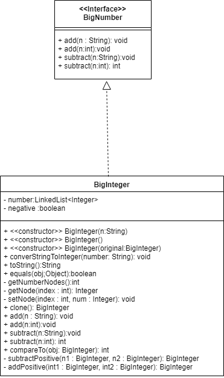
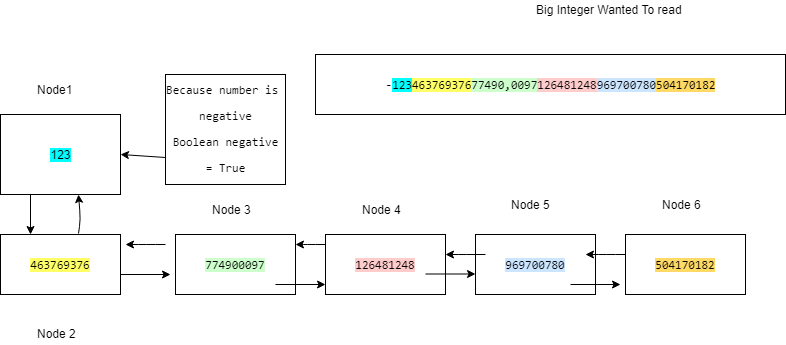

# CS113-GP1-BigInteger
## GP #1 for CS113 - BigInteger ADT implementation + driver (using Agile Development/Scrum)

>Java’s signed long datatype maxes out at (2^63) - 1, but currently, the largest known prime number is (2^77,232,917) - 1. Mathematicians who search for prime numbers need to be able to hold gigantic numbers of any size. As well, they need to be able to iterate through values by adding (a rudimentary example would be the Sieve of Eratosthenes, a simple, ancient algorithm for finding all prime numbers up to any given limit). Your group’s job is to create an abstract data type (ADT) which will hold any size integer, your implementation should allow the creation of the BigInteger from a String, as well as adding/subtracting from int and String type data. You will use a LinkedList and iterator, since using an array would have over twenty three million digits and increasing the array’s size would be a costly and unneeded operation.

The following problem will be done in groups of two using Agile Development (Scrum).  For this first group project, Sprint 0 has been done for you as a sample of what you expect for future group projects, as well as the details of Sprint 1 and 2.  ***Your group need only write the code for Sprint 1 and Sprint 2, also fitting the definition of done.***  Remember that at the end of each sprint you should have a working produce to showcase (each week there will be a check-in during class time).

## Sprint 0 (Planning sprint)
- [x] Gather requirements
- [x] Think, dialogue with partner, and make some big technical decisions (decide on data structure(s) that is/are the most reasonable for implementation, classes to create, methods for each, diagrams, etc.)
- [x] Create detailed description of what you are accomplishing/doing
- [x] Breakdown into two logical/doable sprints (Sprint 1 and Sprint 2)
- [x] Formally define **each** sprint with the following (*see Topic 1 for more details*):
	- [x] User Story (1-2 sentences in everyday language of end user that summarizes what needs to be developed)
	- [x] Create list of tasks and tests, using an Agile task board to keep track (we'll use Trello)
	- [x] Create definition of done (required for every sprint):
		- *Code adheres to coding standard/convention*
		- *Code is documented*
		- *Code checked into GitHub*
		- *Unit tests were written, all pass*
		- *Relevant diagrams and documentation updated and accurate (UML class/sequence diagrams, etc.)*

## Sprint 1 (BigInteger foundation)
**User Story**:
>As a ***programmer using the BigInteger class*** I want to ***be able to represent numbers of any size, negative or positive,*** so that ***I can display them to the user***.

**Documentation Diagrams**:

**Definition Of Done**:
- [x] General requirements 
- [x] Draw an example of how a large integer will be stored as a LinkedList (you can use one of the larger JUnit test values for the example, make sure to add image to this README.md in space provided above)
- [x] Passes all JUnit tests for this sprint
	- [x] Works for small positive integers (fit in `int` data type)
	- [x] Works for small negative integers
	- [x] Works for large positive integers
	- [x] Works for large negative integers
	- [x] Commas ignored in all tests
- [x] Complete following statement in space below:
>Our strategy for implementing addition/subtraction for Sprint 2 is 
1. Start with the last node in both BigIntegers
2. Add each node and save carry number and apply them to the next node.
- [  ] Product owner agrees

## Sprint 2 (BigInteger arithmetic + driver)
**User Story**:
>As a ***programmer using the BigInteger class*** I want to ***be able to add and subtract numbers of any size, negative or positive,*** so that ***I can do arithmetic operations on huge numbers***.

**Documentation Diagrams**:

**Definition Of Done**:
- [x] General requirements 
- [x] Passes all JUnit tests for this sprint
	- [x] Single digit number addition that causes carry (ex: 5 + 9)
	- [x] Multi-digit number addition that causes carry (ex: 7 + 14)
	- [x] Larger number addition that causes carry (ex: 999999 + 1)
	- [x] Swap numbers to show order doesn't matter (ex: 1 + 999999)
	- [x] Very large number addition tests (larger than `long`, swapped as well)
	- [x] Adding negative numbers, swapped, etc. (ex: -1 + 1, 1 + -1, -1 + (-1))
	- [x] Same tests above for subtraction
- [x] Implement driver which solves [Problem 13](https://projecteuler.net/problem=13) from Project Euler to showcase Sprint 2
- [  ] Product owner agrees

----------
### Make sure to commit + push *before* the deadline to have your code be considered for grading.
>Pro-Tips:
>- Trello has been integrated into your Slack private channel, as you or your partner make changes you'll see them come up in Slack.  That means you may be getting a lot of notifications! Slack has a "Do not disturb" mode you can set for certain hours, but make sure you are checking Slack often and communicating with your partner!
>- Make sure to assign each other tasks, its easier to track and handle than assigning each other files/methods to create.  It also helps your instructor in grading, so make sure at the end of the sprint that the Trello board is accurate with who was involved in which task (if you helped debug, add yourself to the task and leave a comment about it!)
>- If you think a set of tasks is related enough (like for a specific method), then assign each other that set of tasks to make it easier to code.  Each team works differently, experiment each sprint to see what works for you and for your team!
>- Implement the given Interface, methods only apply for Sprint 2 so have each method throw an `UnsupportedOperationException` to get the JUnit test to compile
>- Notice the `@Ignore` flags above Sprint 2 JUnit tests.  This is so if you run the whole JUnit test for Sprint 1, it will ignore those tests (there is a "Show Ignored" button above the JUnit test runs where you can hide all the ignored ones, only see the tests that actually run).  Make sure to remove the `@Ignore`s when you are ready to test Sprint 2!
